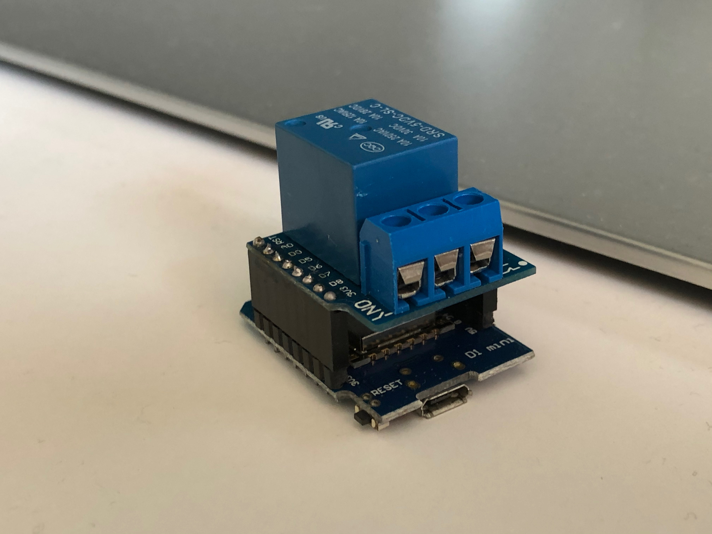
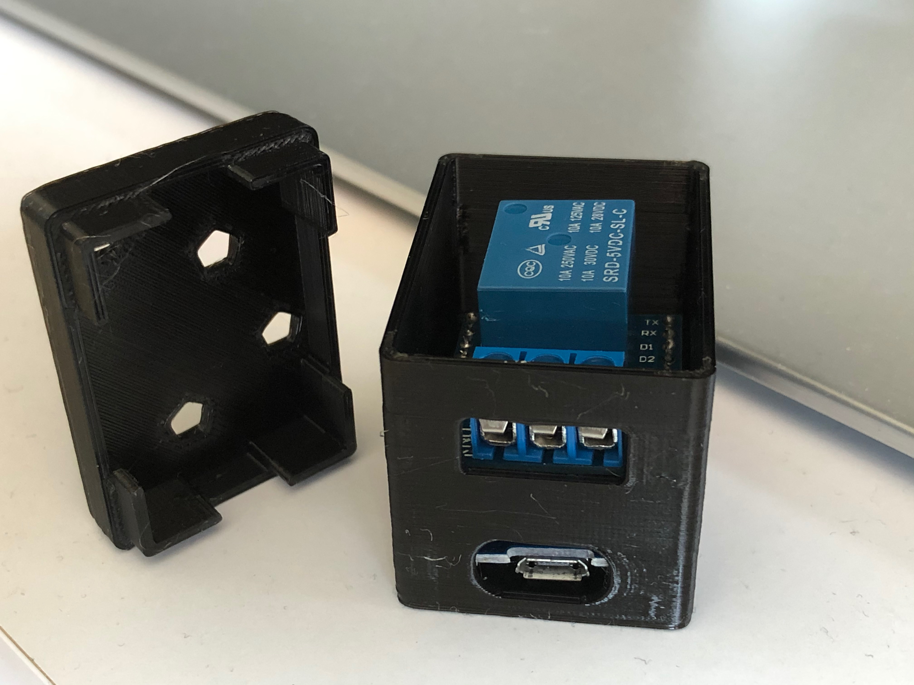
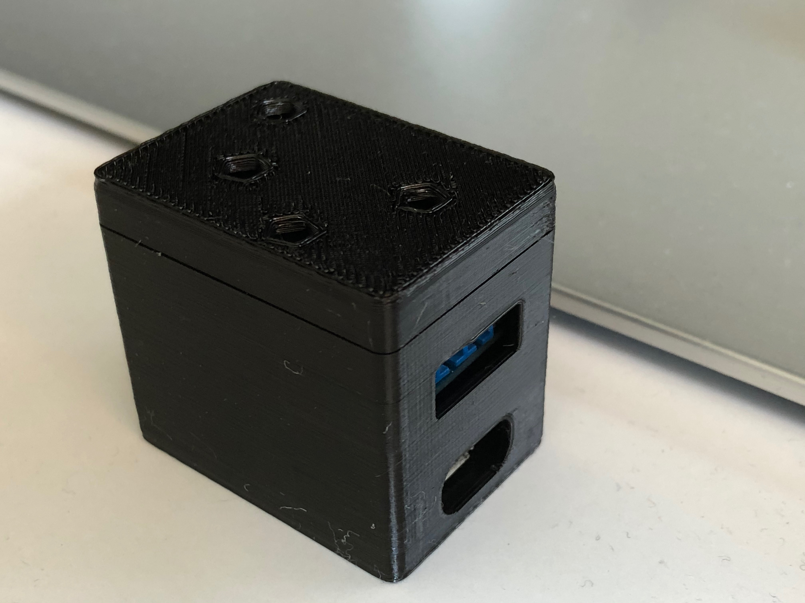

# Hardware — Relay Shield / On Air Light build

This fork targets a specific hardware variant: a **Wemos D1 Mini** (ESP8266)
with a **relay shield** stacked on its pin headers, used to switch power to
a USB-powered "on air" light rather than driving an RGB LED directly. This
document covers the parts, pin mapping, wiring, and the 3D-printed
enclosure. For the base project's own DIY guide (WiFi setup, web UI, tally
modes in general), see the upstream
[wiki DIY guide](https://github.com/AronHetLam/ATEM_tally_light_with_ESP8266/wiki/DIY-guide) —
everything below only covers what's different for this build.

## Parts

- Wemos D1 Mini (ESP8266)
- A relay shield for the D1 Mini's pin headers — built around an
  **SRD-5VDC-SL-C** relay (5V coil, SPDT contacts rated 10A @ 125/250VAC or
  10A @ 28/30VDC)
- USB-powered light/tally lamp (~2A draw)
- 5V USB power source, sized for board + light combined (see
  [Power wiring](#power-wiring) below)

## Pin mapping (ESP8266 / D1 Mini)

The relay shield's control input is wired to what upstream calls the LED1
"Red" channel, with Red and Blue swapped from the stock pin assignment so
the shield lines up correctly:

| Signal | GPIO | D1 Mini pin | Notes |
|---|---|---|---|
| `PIN_RED1` (relay control) | GPIO5 | D1 | Drives the relay shield |
| `PIN_BLUE1` | GPIO16 | D0 | Unused by the relay build |
| `PIN_GREEN1` | GPIO4 | D2 | Unused by the relay build |
| `PIN_RED2` | GPIO2 | D4 | Also the D1 Mini's onboard LED |
| `PIN_GREEN2` | GPIO14 | D5 | Unused (set LED2 mode to "LED Off") |
| `PIN_BLUE2` | GPIO12 | D6 | Unused (set LED2 mode to "LED Off") |

Set LED1's mode to **On Air Light** (or **On Air Streaming**, depending on
which behavior you want — see the main README) and LED2's mode to **LED
Off** on the setup page, since this build only has one physical output.

> If you're instead building the original bare RGB-LED version from
> upstream's DIY guide using this fork's firmware, note that Red and Blue
> for LED1 are swapped from the stock wiring — swap your LED leads to
> match, or the colors will come out wrong.

## Relay wiring

The relay shield's dry contacts (COM / NO) are wired in series with the
light's positive power lead — a simple single-throw switch interrupting the
light's power cable, not the light's data or signal lines. The relay coil
itself draws its ~70–100mA from the D1 Mini's 5V rail; only the light's
current (~2A) passes through the switched contacts.

## Power wiring

As built, the enclosure exposes two separate connectors: a micro-USB port
for the D1 Mini's own power, and a screw terminal block for the relay's
switched output to the light. That's two power inputs feeding the same 5V
system — the D1 Mini's `5V` header pin is internally tied straight to its
micro-USB VBUS pin (no regulator in between), so there's no electrical
reason to keep them separate.

**These can be consolidated into a single incoming 5V feed:**

1. Use one 5V power source rated for the combined load — **5V/3A (15W)
   minimum**, covering the light (~2A), the D1 Mini (~200–300mA peak on
   WiFi TX), and the relay coil (~70–100mA while energized). Don't power
   this off a computer USB port or basic hub port — those are current
   limited (500mA–900mA) and won't sustain 2A to the light.
2. At the point the incoming 5V/GND enters the enclosure, split it:
   - One leg to the D1 Mini's `5V` / `G` header pins (bypassing its
     micro-USB jack).
   - One leg to the relay's COM terminal; NO → light's V+ lead; light's GND
     returns straight to common ground (only the positive leg is switched).
3. Use **20–22AWG** wire for the shared runs — at 2A, thin cable can sag
   enough in voltage to brown out the ESP8266 (dropped WiFi, resets) when
   the light's inrush current hits.
4. Optional but recommended: a **470–1000µF bulk capacitor** across 5V/GND
   near the D1 Mini, to absorb the relay-click and light-inrush transient.

This doesn't require redesigning the enclosure — the relay's terminal block
already accepts external wiring, so the single incoming 5V/GND pair can
just be landed on both the terminal block and the D1 Mini's header pins
inside the case, and the micro-USB port left unused (or removed on a future
enclosure revision).

## Enclosure

A two-piece 3D-printed enclosure sized for the D1 Mini + relay shield stack,
plus a separate mounting bracket with three keyhole-style mounting holes.
STL files are in [`enclosure/`](enclosure/):

- [`wemos_relay_bottom_01.stl`](enclosure/wemos_relay_bottom_01.stl) — main
  body; front face has a cutout for the relay's screw terminal block and an
  oval cutout for the D1 Mini's micro-USB port.
- [`wemos_relay_top_01.stl`](enclosure/wemos_relay_top_01.stl) — lid /
  mounting bracket with three hex-profile mounting holes.

| | |
|---|---|
|  | The relay shield (SRD-5VDC-SL-C + screw terminal block) stacked on the D1 Mini's pin headers, before going into the enclosure. |
|  | Assembled into the case: the relay's terminal block and the D1 Mini's micro-USB port are both accessible through cutouts in the front face. |
|  | Closed enclosure with the mounting bracket attached on top. |

If you consolidate to a single power feed as described above, both wires
land on the same terminal block / header pins already accessible through
these cutouts — no enclosure changes needed.
